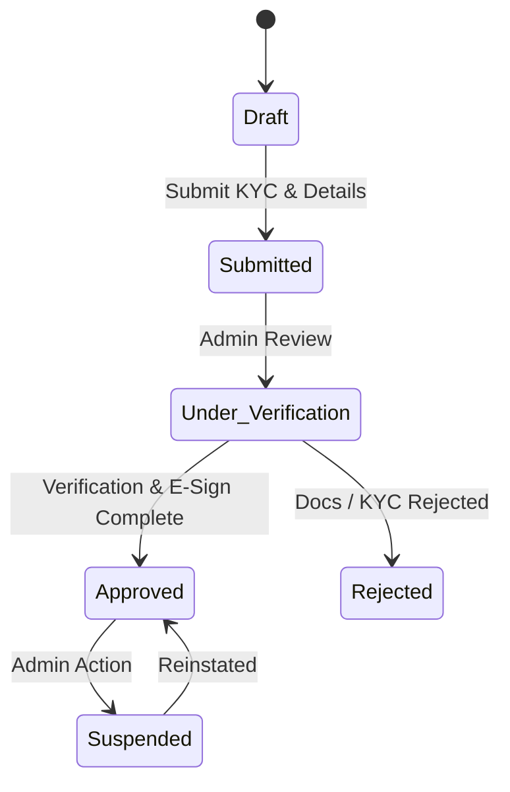
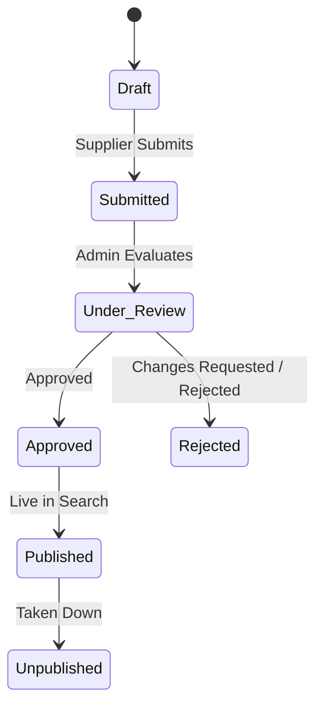
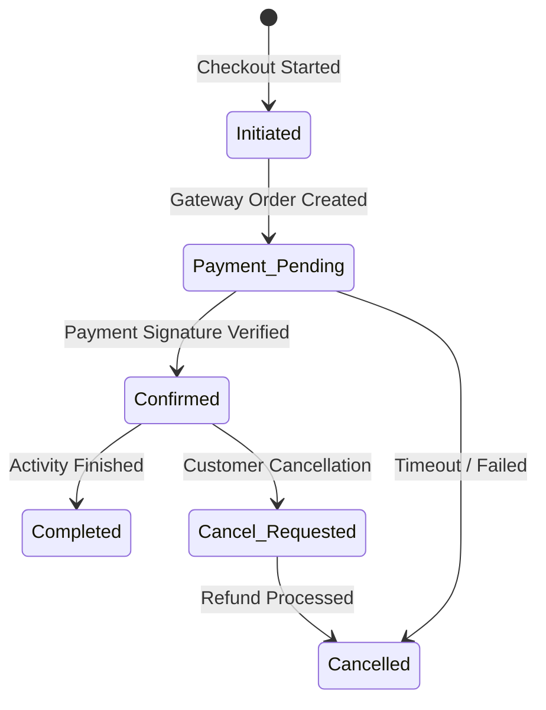
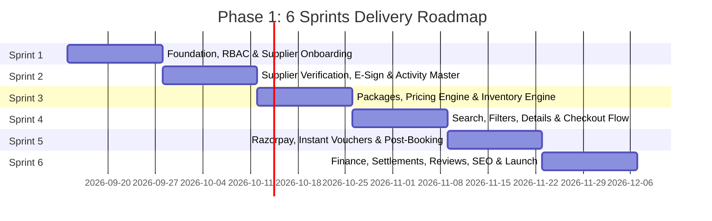

# Activity Booking Platform
## Phase 1 — Detailed Functional & Technical Specification & Sprint Plan
**AI-Coding / Developer Implementation Document • Target: Production-ready Phase 1 by December 2026**

---

> [!IMPORTANT]
> **Implementation Rule:** Freeze Phase 1 requirements before development. New requirements after freeze should be treated as change requests and evaluated against the December 2026 delivery target.

---

# PART A: OFFICIAL FUNCTIONAL & TECHNICAL SPECIFICATION

## 1. Purpose
This document is the detailed Phase 1 implementation specification for a B2C activity-booking marketplace. It expands the original proposal into developer- and AI-coding-tool-ready requirements. Suppliers onboard and publish activities; administrators verify/approve them; customers discover, book, pay, receive vouchers and manage bookings.

**Architecture baseline:** Next.js frontend, Node.js REST API, MySQL, OTP/SMS, e-sign, payment gateway and email services, as defined in the original proposal.

---

## 2. Technology & Architecture

| Layer | Requirement |
|---|---|
| **Frontend** | Next.js, responsive B2C website and role-based dashboards |
| **Backend** | Node.js REST API, API-first |
| **Database** | MySQL, normalized relational schema and migrations |
| **Authentication** | Customer OTP; secure supplier/admin authentication; RBAC |
| **Payments** | Razorpay or approved equivalent; server-side verification and webhooks |
| **Notifications** | Transactional email + SMS; provider abstraction |
| **Documents** | Object/file storage for media, KYC documents and vouchers |
| **QR** | Unique QR code for confirmed vouchers |
| **SEO** | SSR/indexable pages, metadata, sitemap and robots |
| **Analytics** | GA4 or approved analytics platform |

---

## 3. Roles & Permissions

| Role | Permissions |
|---|---|
| **Customer** | Search, filter, view, book, pay, view trips, cancel eligible bookings, review completed bookings |
| **Supplier** | Company/KYC, activities, packages, pricing, slots, inventory and bookings |
| **Site Admin** | Approvals, users, activities, bookings, coupons, configuration and reports |
| **Accountant / Finance** | Revenue, commission, refunds and settlement reporting/actions as permitted |

---

## 4. Phase 1 Modules

| # | Module |
|---|---|
| 1 | Supplier registration + KYC/e-sign |
| 2 | Activity creation |
| 3 | Activity packages/options |
| 4 | Pricing + date/time slots + inventory |
| 5 | Admin approval |
| 6 | Customer search + filters |
| 7 | Activity detail page |
| 8 | Customer login/OTP |
| 9 | Traveller details |
| 10 | Booking + Razorpay/payment gateway |
| 11 | Instant confirmation |
| 12 | Voucher + QR code |
| 13 | Email/SMS notifications |
| 14 | Cancellation + refund |
| 15 | Supplier booking dashboard |
| 16 | Admin booking dashboard |
| 17 | Commission/markup calculation |
| 18 | Basic supplier settlement report |
| 19 | Coupons |
| 20 | My Bookings/My Trips |
| 21 | Basic reviews/ratings |
| 22 | SEO basics |
| 23 | Analytics |
| 24 | QA/UAT/deployment |

---

## 5. Core Business Model
```
Activity → Package/Option → Date/Time Slot → Inventory → Pricing → Booking → Payment → Voucher → Settlement
```
> [!CAUTION]
> **Data Modeling Rule:** Do not model all pricing and inventory directly on the Activity record. One activity may have multiple packages with different prices, inclusions, cancellation rules, slots and inventory.

---

## 6. Detailed Module Specifications

### 6.1 Supplier Registration + KYC/e-sign [COMPLETED]
- [x] Registration with email/mobile OTP verification with failed attempt rate limiting (5 attempts -> 10m block).
- [x] Capture company/legal details, contact person, address, business/tax identifiers where applicable and bank/settlement details.
- [x] Upload KYC/legal documents with document type, status and expiry where applicable (`expiry_date` supported).
- [x] Supplier lifecycle: `Draft → Submitted → Under Verification → Approved / Rejected / Suspended`.
- [x] Admin can approve/reject documents (`/admin/suppliers/:id/documents/:docId/verify`) and supplier application with reason.
- [x] Generate supplier agreement/e-sign document and track signer/signature status (`/suppliers/esign`, `/suppliers/esign/sign`).
- [x] Supplier cannot publish activities until approved and e-signed (guarded by `requireSupplierApproved`).
- [x] Maintain audit history for status changes and verification (`audit_logs` tracking actor, entity, old/new values, reasons, and IPs).

### 6.2 Activity Creation
- Capture title, slug, destination, category, short/full description, highlights, duration, meeting point, map coordinates, itinerary, inclusions, exclusions, requirements, restrictions, age limits, what-to-carry, cancellation policy and terms.
- Upload multiple images and optional video; select ordering/primary image.
- Capture languages, activity type, confirmation type, redemption instructions and supplier contact.
- Statuses: `Draft → Submitted → Under Review → Approved → Published → Unpublished / Rejected`.
- Admin approval is required before public visibility.

### 6.3 Activity Packages / Options
- One activity can contain one or many bookable packages/options.
- Package fields: name, description, duration, inclusions, exclusions, cancellation policy, confirmation mode, capacity rules and active status.
- Examples: Standard, Premium, Private, VIP, Shared, Activity + Add-on.
- Each package has independent pricing, availability and inventory.
- Customer selects a package when multiple options exist.

### 6.4 Pricing + Date/Time Slots + Inventory
- Support adult/child and optional traveller pricing.
- Support date-specific and slot-specific pricing.
- Calendar availability, time slots, capacity, min/max participants, blackout dates, stop-sale and booking cutoff.
- Hold inventory during checkout and release it on payment failure/timeout.
- Use transactional inventory updates to prevent overselling.
- Support instant-confirmation and on-request modes in the data model; Phase 1 uses instant confirmation for eligible activities.
- Keep supplier/base rate and customer selling price separate.

### 6.5 Admin Approval
- Separate supplier and activity approval queues.
- Admin can inspect documents, activity data, media, pricing and policies.
- Approve, reject, request changes, publish/unpublish and suspend.
- Record actor, timestamp, old/new status and reason.

### 6.6 Customer Search + Filters
- Search by destination, activity title and keywords.
- Filters: category, price, duration, time, free cancellation, instant confirmation, rating and activity type.
- Sort by recommended/popularity, price low-high, price high-low and rating.
- Pagination/infinite loading with stable query parameters.
- SEO-friendly destination/category/activity URLs.
- Cards show image, title, destination, duration, rating, cancellation/confirmation badges and starting price.

### 6.7 Activity Detail Page
- Gallery, title, rating, destination, duration, highlights, description, itinerary, inclusions/exclusions, meeting point/map, requirements, restrictions, cancellation policy, important information, FAQs and supplier information.
- Show packages/options with package-specific inclusions, price and availability.
- Select date and travellers and dynamically show slots.
- Show taxes/fees and final payable amount.
- Show similar activities where available.

### 6.8 Customer Login / OTP
- Mobile/email OTP signup/login.
- Create customer profile on first verification.
- Rate-limit OTP requests; enforce expiry and attempt limits.
- Store terms/consent acceptance timestamps.
- Never expose sensitive authentication data in logs.

### 6.9 Traveller Details
- Capture lead traveller name, email and mobile plus required traveller data.
- Support adult/child counts and traveller-level data when required.
- Optional/configured DOB, gender, nationality or ID.
- Validate age/restrictions against selected activity/package.
- Store a traveller snapshot with the booking.

### 6.10 Booking + Razorpay
- Flow: `activity → package → date → slot → travellers → coupon → price review → payment → confirmation`.
- Create temporary booking/order before payment.
- Create Razorpay order server-side; never trust client amount.
- Verify payment signature/webhook server-side.
- Handle success, failure, timeout, duplicate webhooks and retries idempotently.
- Confirm only after verified payment; release inventory on failure/expiry.
- Store gateway order/payment/transaction IDs.

### 6.11 Instant Confirmation
- For eligible activities, verified payment changes booking to Confirmed automatically.
- Generate unique booking reference and voucher.
- Notify customer and supplier.
- Prevent duplicate confirmations/vouchers.

### 6.12 Voucher + QR Code
- Generate downloadable PDF voucher.
- Include booking reference, activity, package, date/time, travellers, meeting point, supplier contact, inclusions, important information and cancellation terms.
- Generate unique QR linked to a secure booking validation endpoint; do not encode sensitive data directly.
- Voucher available from My Trips and configured notifications.

### 6.13 Email/SMS Notifications
- OTP; payment success/failure; booking confirmation; voucher; cancellation; refund; supplier new booking; operational alerts.
- Use templates with booking/activity/customer variables and delivery-status logging.

### 6.14 Cancellation + Refund
- Store cancellation rules in machine-readable form.
- Calculate eligibility and cancellation fee from policy and current time.
- Customer can cancel eligible bookings and see refundable amount.
- Process gateway refund server-side and track status.
- Refund states: `Not Applicable → Requested → Processing → Refunded / Failed`.
- Maintain audit trail and prevent cancellation after redemption/completion unless admin override.

### 6.15 Supplier Booking Dashboard
- Dashboard for upcoming/completed/cancelled bookings, revenue and pending settlement.
- Booking list filters by date/activity/package/status.
- Booking detail with permitted customer/traveller information.
- View/download voucher and operational information.
- Support redemption/status update if required.

### 6.16 Admin Booking Dashboard
- Search by booking ID, customer, supplier, activity, date, payment ID and status.
- Complete booking/payment/refund timeline.
- Admin actions: cancel, refund where authorized, resend voucher/notification, operational status and internal notes.
- Metrics: bookings, GMV, revenue, cancellations, refunds and commission.
- Audit privileged actions.

### 6.17 Commission / Markup
- Store supplier/base rate and customer selling price separately.
- Support percentage commission and/or fixed markup.
- Calculate gross value, commission, payment fee if tracked, supplier payable and refund impact.
- Commission may be supplier/activity/global with documented precedence.
- Freeze financial values into booking snapshots.

### 6.18 Supplier Settlement Report
- Supplier-wise payable report for a selected period.
- Show booking reference, booking date, activity, gross, commission, refund/cancellation adjustments and net payable.
- Settlement states: `Pending → Approved → Paid`.
- CSV/Excel export.
- Phase 1 may use reporting rather than an automated payout engine.

### 6.19 Coupons
- Admin creates percentage or fixed coupons.
- Support validity, minimum order, maximum discount, usage limit, per-customer limit, applicable activities/categories and active status.
- Server-side validation and double-use prevention.
- Store coupon snapshot on booking.

### 6.20 My Bookings / My Trips
- Upcoming, completed and cancelled views.
- Booking detail with status, payment summary, traveller snapshot and voucher.
- Download voucher; cancel if eligible; show refund status; review after completion.

### 6.21 Reviews / Ratings
- Only eligible completed/used bookings can review.
- 1–5 rating and optional text.
- One review per booking unless policy allows otherwise.
- Admin moderation/hide/remove/report.
- Show aggregate rating and count.

### 6.22 SEO Basics
- SSR/indexable activity, category and destination pages.
- Unique title, meta description, canonical URL and SEO-friendly slugs.
- Open Graph metadata; XML sitemap; robots.txt.
- Breadcrumb and activity/product structured data where appropriate.
- Do not index checkout/account/admin/private pages.

### 6.23 Analytics
- GA4 or approved platform.
- Track search, filter, view, package selection, checkout, payment success/failure, booking, coupon and cancellation events.
- Track source/medium/campaign where available.
- Do not send card data or sensitive personal data to analytics.

### 6.24 QA / UAT / Deployment
- Unit tests for business logic.
- API integration tests for auth, inventory, booking, payment webhook, cancellation and refund.
- Frontend tests for customer/supplier flows.
- Security tests for authorization, IDOR, input validation, uploads and webhooks.
- Responsive/cross-browser testing.
- UAT environment with seed data and payment sandbox.
- Production migrations, backups, logging, monitoring, smoke tests and rollback plan.

---

## 7. Core Database Entities

| Entity | Purpose |
|---|---|
| `users` | Authentication identity |
| `roles` / `permissions` / `role_permissions` | RBAC |
| `customer_profiles` | Customer profile |
| `supplier_profiles` | Supplier/company and status |
| `supplier_documents` | KYC/legal verification |
| `esign_documents` | Agreement/signers/signature |
| `destinations` | Destination hierarchy |
| `categories` | Activity categories |
| `activities` | Activity master/content/publishing |
| `activity_media` | Images/videos |
| `activity_packages` | Bookable options |
| `package_pricing` | Customer/supplier pricing |
| `availability_dates` | Date availability |
| `time_slots` | Slots |
| `inventory` | Capacity/remaining inventory |
| `cancellation_policies` | Structured cancellation rules |
| `bookings` / `booking_items` | Booking and package/quantity snapshot |
| `travellers` | Booking traveller snapshot |
| `payments` | Gateway transactions |
| `refunds` | Refund records |
| `vouchers` | Voucher/QR |
| `coupons` / `coupon_redemptions` | Promotion and usage |
| `reviews` | Ratings/reviews |
| `commissions` | Commission/markup configuration |
| `settlements` | Supplier settlement |
| `notifications` | Email/SMS delivery |
| `audit_logs` | Privileged action history |
| `analytics_events` | Optional internal analytics events |

---

## 8. Critical State Machines

### 1. Supplier Lifecycle


### 2. Activity Lifecycle


### 3. Booking Lifecycle


### 4. Refund Lifecycle
```
Not Applicable → Requested → Processing → Refunded / Failed
```

### 5. Settlement Lifecycle
```
Pending → Approved → Paid
```

---

## 9. API Groups & Representative Endpoints

| Group | Representative Endpoints |
|---|---|
| **Auth** | `POST /auth/send-otp`, `POST /auth/verify-otp`, `GET /me` |
| **Supplier** | `POST /suppliers`, `GET/PUT /suppliers/me`, `POST /suppliers/documents` |
| **Activities** | `POST/GET/PUT /activities`, `GET /activities/:slug`, `submit/approve/publish` |
| **Packages** | `GET/POST/PUT /activities/:id/packages` |
| **Availability** | `GET/POST/PUT /packages/:id/availability`, `/slots`, `/inventory` |
| **Search** | `GET /activities?destination=&date=&category=&minPrice=&maxPrice=&duration=&sort=` |
| **Booking** | `POST /bookings/quote`, `POST /bookings`, `GET /bookings/:id`, `GET /my/bookings` |
| **Payment** | `POST /payments/create-order`, `POST /payments/verify`, `POST /payments/webhook` |
| **Voucher** | `GET /bookings/:id/voucher`, `GET /bookings/:id/qr` |
| **Cancellation** | `POST /bookings/:id/cancel`, `GET /bookings/:id/refund` |
| **Coupons** | `POST/GET/PUT /admin/coupons`, `POST /coupons/validate` |
| **Reviews** | `POST /bookings/:id/review`, `GET /activities/:id/reviews` |
| **Supplier/Admin** | `GET /supplier/bookings`, `GET /admin/bookings`, `GET /admin/bookings/:id` |
| **Finance** | `GET /admin/settlements`, `GET /admin/commission-report` |

---

## 10. Security Requirements
1. Enforce RBAC and object-level authorization server-side.
2. Validate/sanitize input and uploaded files.
3. Never trust client price, inventory or payment status.
4. Verify Razorpay signatures/webhooks and make processing idempotent.
5. Protect sensitive data; never log OTPs, secrets or payment credentials.
6. Rate-limit OTP, login, coupon and public APIs.
7. Use HTTPS in non-local environments.

---

## 11. Non-Functional Requirements
1. Responsive desktop/tablet/mobile UI.
2. API-first separation between frontend and backend.
3. Version-controlled DB migrations.
4. Centralized errors and structured logs.
5. Environment variables for third-party services.
6. Pagination on large lists.
7. Idempotency for payment, booking, refund and notification retry operations.
8. Database backup/restore procedure.
9. Automated tests for critical workflows.

---

## 12. Phase 1 Exclusions
- CRM lead/sales pipeline
- B2B/agent/corporate portal
- Native mobile apps
- Multi-language/multi-currency
- Advanced recommendation/personalization
- Complex automated supplier payout engine beyond settlement reporting
- Advanced dynamic pricing
- Advanced customer support/ticketing CRM
- External supplier API aggregation unless separately approved

---

## 13. Suggested 12-Week Delivery Plan

| Week | Deliverables |
|---|---|
| **1** | Architecture, DB, migrations, auth/RBAC, CI/CD, UI foundation |
| **2** | Supplier registration, OTP, profile, KYC upload |
| **3** | KYC verification, e-sign, supplier approval |
| **4** | Activity creation, media, categories/destinations, approval |
| **5** | Packages/options, pricing, cancellation policy, availability |
| **6** | Slots, inventory, blackout/stop-sale, booking cutoff, supplier dashboard |
| **7** | Customer search, filters, listing cards, activity detail |
| **8** | Customer OTP/login, travellers, quote/checkout, coupons |
| **9** | Razorpay, webhook/idempotency, confirmation, voucher/QR |
| **10** | Notifications, cancellation/refund, My Trips, supplier/admin booking dashboards |
| **11** | Commission/settlement, reviews, SEO, analytics |
| **12** | QA, security, UAT, fixes, production deployment and smoke tests |

---

## 14. AI Coding Tool Master Prompt
> *Use this document as the authoritative Phase 1 specification. Build a production-ready B2C activity booking marketplace using Next.js, Node.js REST APIs and MySQL. Implement modules in vertical slices and in the stated delivery order. Before coding a module, inspect the existing codebase and preserve its conventions. Create migrations, backend validation, authorization, APIs, frontend pages/components, tests and seed data for each module. All prices, inventory, commissions, cancellation/refund calculations and payment status are server-authoritative. Razorpay webhook/payment processing must be signature-verified and idempotent. Sensitive/privileged actions must be authorized and audited. Keep third-party providers behind service interfaces. Do not implement Phase 2 features unless explicitly requested. At completion of each module, report files changed, migrations/API changes, tests executed and unresolved assumptions.*

---

## 15. Definition of Done (DoD)
1. Approved supplier can create and publish an approved activity with at least one package.
2. Package supports date/slot availability, capacity and customer pricing.
3. Customer can search/filter, view details, select package/date/slot/travellers.
4. Customer can apply a valid coupon and see a server-calculated final price.
5. Customer can pay through Razorpay sandbox and server verifies payment.
6. Confirmed booking receives unique reference and voucher with QR.
7. Customer and supplier receive configured notifications.
8. Supplier and admin can see/manage bookings.
9. Eligible customer can cancel and system calculates/processes refund.
10. Commission and supplier payable are reportable.
11. Customer can view My Trips and review an eligible completed booking.
12. SEO metadata/sitemap/robots and analytics events are implemented.
13. Critical automated tests pass; UAT is signed off; production deployment and rollback procedures are documented.

---

# PART B: SPRINT-WISE IMPLEMENTATION BREAKDOWN (6 SPRINTS)

The 12 weeks are divided into **6 two-week Sprints** executed in vertical slices (DB → API → Security → UI → Tests).



---

### 🏃 SPRINT 1 (Weeks 1 & 2): Core Foundation, RBAC & Supplier Onboarding
**Focus:** Database schema baseline, API-first architecture, RBAC, SMS/Email OTP service abstraction, supplier self-registration, and KYC upload.

#### Target Modules:
- Core Architecture & Foundation
- **Module 1 (Part 1):** Supplier registration + Mobile/Email OTP + KYC upload

#### DB Entities in this Sprint:
- `users`, `roles`, `permissions`, `role_permissions`
- `supplier_profiles`, `supplier_documents`

#### Deliverables & Endpoints:
1. Setup Winston/Pino structured logging, MySQL migrations, and centralized error handler.
2. Setup OTP service abstraction (Phone SMS + Email dispatch with identical 6-digit OTP).
3. Endpoints:
   - `POST /auth/send-otp` (Rate limit: 3 requests/10 min)
   - `POST /auth/verify-otp` (Issue JWT, create `users` & `supplier_profiles` record)
   - `GET /suppliers/me` & `PUT /suppliers/me` (Legal company name, address, tax ID, bank details)
   - `POST /suppliers/documents` (Multipart upload for Trade License, ID proof, Tax certificate)
4. Next.js Frontend:
   - Shared design system tokens, responsive navbar & footer.
   - Supplier Registration 3-Step Wizard (OTP validation, Company details, Drag-and-drop document upload).
   - "Under Verification" pending status banner.

---

### 🏃 SPRINT 2 (Weeks 3 & 4): Supplier Approval, E-Sign & Activity Master
**Focus:** Admin KYC document verification, digital E-Sign agreement, supplier approval state machine, activity catalog creation, categories/destinations, and media management.

#### Target Modules:
- **Module 1 (Part 2):** Admin KYC verification, E-sign generation & supplier approval
- **Module 2:** Activity Creation (Content, itinerary, media, meeting point)
- **Module 5 (Part 1):** Admin Approval Queue (Suppliers & Activities)

#### DB Entities in this Sprint:
- `esign_documents`, `destinations`, `categories`
- `activities`, `activity_media`, `audit_logs`

#### Deliverables & Endpoints:
1. Endpoints:
   - `GET /admin/suppliers` (Filter by `Submitted`, `Under_Verification`, `Approved`, `Rejected`)
   - `PUT /admin/suppliers/:id/documents/:docId` (Approve/Reject doc with reason)
   - `POST /suppliers/esign/sign` (Digital signature capture with timestamp & IP logging)
   - `PUT /admin/suppliers/:id/status` (Transition to `Approved` or `Rejected`)
   - `POST /activities`, `PUT /activities/:id` (Activity draft, title, slug, itinerary, meeting point)
   - `POST /activities/:id/media` (Gallery images & video upload, set primary image)
   - `POST /activities/:id/submit` (Submit activity for admin review)
   - `PUT /admin/activities/:id/review` (Admin approve/reject/request changes)
2. Next.js Frontend:
   - Admin Supplier Verification Dashboard (Side-by-side document previewer & approve/reject dialog).
   - Supplier E-Sign Agreement modal.
   - Supplier Multi-step Activity Creator:
     - Section 1: Overview & Location (Destination, Category, Map coordinates, Meeting point).
     - Section 2: Itinerary, Highlights, Inclusions & Exclusions bullet points.
     - Section 3: Media Uploader (Reorder images, pick hero image, add video link).
     - Section 4: What to carry, age limits & restrictions.

---

### 🏃 SPRINT 3 (Weeks 5 & 6): Packages, Pricing Engine, Slots & Inventory
**Focus:** Multi-package support per activity, adult/child pricing schemas, date calendars, time slots, concurrency-safe transactional inventory control, and supplier operations dashboard.

#### Target Modules:
- **Module 3:** Activity packages/options
- **Module 4:** Pricing + date/time slots + inventory
- **Module 15:** Supplier booking dashboard

#### DB Entities in this Sprint:
- `activity_packages`, `cancellation_policies`, `package_pricing`
- `availability_dates`, `time_slots`, `inventory`

#### Deliverables & Endpoints:
1. Concurrency-safe inventory updates:
   - Row-level lock (`SELECT ... FOR UPDATE`) on slots to prevent overselling.
   - 15-minute inventory hold worker for checkout sessions.
2. Endpoints:
   - `POST/PUT /activities/:id/packages` (Create Standard, VIP, Private options)
   - `PUT /packages/:id/pricing` (Adult base/sell price, Child base/sell price, date-specific rates)
   - `POST/PUT /packages/:id/slots` (Recurring daily slots, start/end time, capacity, cutoff hours)
   - `POST /packages/:id/availability` (Date-specific blackout dates, stop-sale)
   - `GET /supplier/dashboard/stats` (Upcoming slots, passenger count, active activities)
3. Next.js Frontend:
   - Supplier Package & Option builder.
   - Interactive Month/Week Availability Calendar (Stop-sale toggles, blackout markers, capacity gauges).
   - Slot manager dialog with pax capacity rules.
   - Supplier Booking Manifest (Today's departures, guest lists).

---

### 🏃 SPRINT 4 (Weeks 7 & 8): Search Engine, Activity Details & Checkout Flow
**Focus:** Faceted search & filters, SSR activity detail page with live slot/package selector, customer OTP auth, traveller details capture, price quote API, and coupon engine.

#### Target Modules:
- **Module 6:** Customer search + filters
- **Module 7:** Activity detail page
- **Module 8:** Customer login/OTP
- **Module 9:** Traveller details
- **Module 19:** Coupons

#### DB Entities in this Sprint:
- `customer_profiles`, `coupons`, `coupon_redemptions`

#### Deliverables & Endpoints:
1. Endpoints:
   - `GET /activities` (Search by destination, category, price, duration, rating, free cancellation, instant confirmation)
   - `GET /activities/:slug` (Full activity detail with packages, inclusions, FAQs, meeting point)
   - `GET /packages/:id/availability?month=YYYY-MM` (Available dates with capacity)
   - `GET /packages/:id/slots?date=YYYY-MM-DD` (Available time slots with remaining seats)
   - `POST /coupons/validate` (Server-side coupon validation, check min order, max discount, usage limits)
   - `POST /bookings/quote` (Server-authoritative price breakdown: Subtotal, adult/child breakdown, discount, taxes, total)
   - `POST /auth/customer/send-otp` & `POST /auth/customer/verify-otp` (Customer OTP signup/login)
2. Next.js Frontend:
   - Search & Filter Results Page (Sticky filter sidebar, sort dropdown, responsive activity cards).
   - SSR Activity Detail Page:
     - Hero gallery with photo lightbox.
     - Live Booking Widget: Step 1: Package → Step 2: Date Picker → Step 3: Slot Selector → Step 4: Pax counter.
     - Tabs for Highlights, Itinerary, Inclusions/Exclusions, FAQs, Location Map.
   - Checkout Flow:
     - Lead traveller + guest info form (Name, Age category).
     - Coupon promo code input with instant savings pill.
     - Final itemized price review.

---

### 🏃 SPRINT 5 (Weeks 9 & 10): Razorpay, Instant Vouchering, Post-Booking & Cancellations
**Focus:** Razorpay order creation, HMAC signature verification, idempotent webhooks, instant confirmation, PDF voucher with secure QR code, automated notifications, cancellation policy calculation, and gateway refunds.

#### Target Modules:
- **Module 10:** Booking + Razorpay payment gateway
- **Module 11:** Instant confirmation
- **Module 12:** Voucher + QR code
- **Module 13:** Email/SMS notifications
- **Module 14:** Cancellation + refund
- **Module 16:** Admin booking dashboard
- **Module 20:** My Bookings / My Trips

#### DB Entities in this Sprint:
- `bookings`, `travellers`, `payments`, `vouchers`, `refunds`, `notifications`

#### Deliverables & Endpoints:
1. Payment & Webhooks:
   - `POST /payments/create-order` (Reserve inventory, generate temporary booking, create Razorpay Order)
   - `POST /payments/verify` & `POST /payments/webhook` (HMAC signature verification, idempotency check, transition to `Confirmed`)
2. Voucher & QR Code:
   - `GET /bookings/:id/voucher` (Generate PDF voucher with Puppeteer/PDFKit)
   - `GET /bookings/:id/qr` & `GET /vouchers/verify?token=JWT` (Encrypted verification link)
3. Cancellations & Refunds:
   - `POST /bookings/:id/cancel` (Calculate cancellation fee & refund amount based on policy hours, execute Razorpay refund)
   - `GET /bookings/:id/refund` (Track refund status: `Requested → Processing → Refunded`)
4. Notifications:
   - Automated Email & SMS alerts for Booking Confirmation, Voucher, Cancellation, and Refund.
5. Next.js Frontend:
   - Razorpay Modal checkout integration with failure retry handlers.
   - Booking Success Screen with 1-click PDF voucher download.
   - Customer "My Trips" dashboard (`Upcoming`, `Completed`, `Cancelled` tabs).
   - Cancellation modal showing live refundable calculation before confirmation.
   - Admin Booking Management Center (Full payment timeline, manual resend voucher, manual refund overrides).

---

### 🏃 SPRINT 6 (Weeks 11 & 12): Finance, Settlements, Reviews, SEO, Analytics & Go-Live
**Focus:** Financial commission & markup snapshots, supplier settlement reporting (CSV/Excel export), verified customer reviews, SSR SEO metadata & sitemaps, GA4 analytics, security audits, and production deployment runbook.

#### Target Modules:
- **Module 17:** Commission / markup calculation
- **Module 18:** Supplier settlement report
- **Module 21:** Basic reviews / ratings
- **Module 22:** SEO basics
- **Module 23:** Analytics
- **Module 24:** QA / UAT / Deployment

#### DB Entities in this Sprint:
- `commissions`, `settlements`, `reviews`, `analytics_events`

#### Deliverables & Endpoints:
1. Finance & Settlements:
   - Freeze supplier payable and marketplace commission into booking records upon confirmation.
   - `GET /admin/settlements` (Supplier-wise payable ledger with date filters)
   - `GET /admin/settlements/export` (Export CSV/Excel sheet)
   - `PUT /admin/settlements/:id/status` (`Pending → Approved → Paid`)
2. Reviews:
   - `POST /bookings/:id/review` (Only for eligible `Completed` bookings; rating 1–5 + comment)
   - `GET /activities/:id/reviews` (Paginated verified reviews & aggregate rating breakdown)
   - `PUT /admin/reviews/:id/moderate` (Admin hide/publish review)
3. SEO & Analytics:
   - SSR dynamic `sitemap.xml` and `robots.txt`.
   - JSON-LD Structured Data (`TouristAttraction`, `Product`, `AggregateRating`, `BreadcrumbList`).
   - GA4 enhanced e-commerce event triggers (`view_item`, `begin_checkout`, `purchase`, `refund`).
4. Next.js Frontend:
   - Accountant & Admin Settlement Dashboard with CSV export button.
   - Post-trip Review submission modal and public Reviews showcase on detail page.
   - SEO metadata injection per page.
5. QA & Security Hardening:
   - IDOR vulnerability checks (verify customer can only view own bookings).
   - SQL injection & XSS sanitization audit.
   - Concurrency stress testing on slot checkout.
   - UAT sign-off across Customer, Supplier, and Admin workflows.
   - Production deployment runbook, database backup crons, and rollback plan.

---

## 16. Development Rule & Guidelines
1. **Vertical Slices:** Every sprint deliverable must follow the full vertical stack: Database Migrations → Backend Services & Endpoints → Security / RBAC → Frontend Next.js Screens → Automated Unit & Integration Tests.
2. **Server Authority:** Never trust the browser for price amounts, discount calculations, inventory holds, or payment status. All state changes are strictly server-authoritative.
3. **Auditability:** Every privileged action (document verification, supplier approval, activity publishing, booking cancellation, manual refund, settlement payout) must be logged in `audit_logs`.
4. **Target Date:** Strict adherence to Phase 1 scope to achieve production launch by December 2026.
